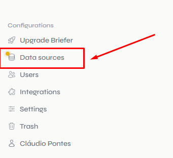
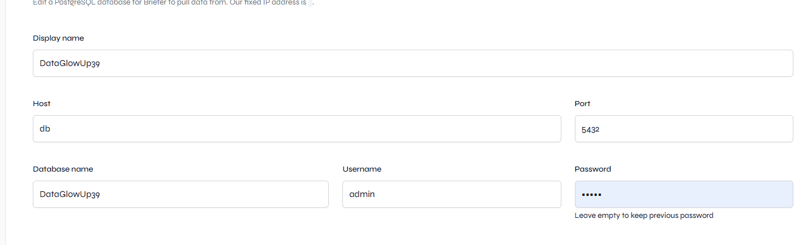
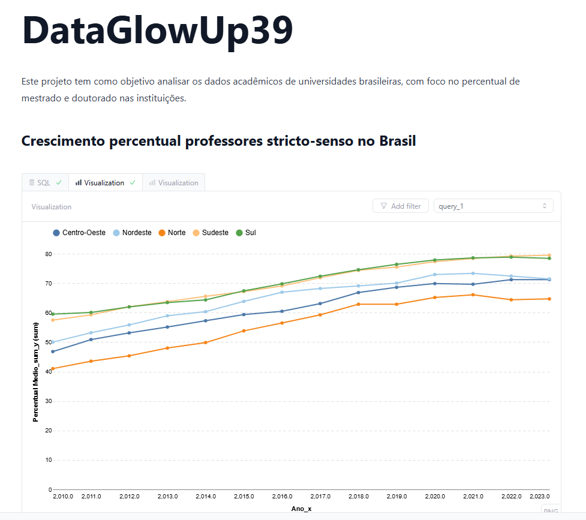

# Desafio DataGlowUp39:

## Transformando Dados do INEP


## Objetivo

Este projeto faz parte do desafio **DataGlowUp39** e tem como objetivo pegar dados públicos do INEP (Instituto Nacional de Estudos e Pesquisas Educacionais Anísio Teixeira), transformá-los e armazená-los em um banco de dados bem estruturado. O foco do projeto é garantir que o processo de extração, transformação e carga (ETL) seja bem executado, minimizando o risco de erros ao longo do caminho.
Além disso esse projeto demonstra de forma simplificada como seria um projeto real de ETL contando com etapas de extração, transformação validação e carga dos dados em um SGBD

## Dados

O projeto utiliza dados abertos disponíveis no inep

- [Indicadores Educacionais do INEP](https://www.gov.br/inep/pt-br/acesso-a-informacao/dados-abertos/indicadores-educacionais)


## Arquitetura

- **python**: Define a versão do Python usada no projeto.  
- **requests**: Realiza requisições HTTP para baixar arquivos e acessar APIs.  
- **bs4 (BeautifulSoup)**: Extrai e manipula dados de documentos HTML e XML.  
- **pandas**: Manipula e analisa dados em estruturas como DataFrames e Series.  
- **sqlalchemy**: Gerencia interações com bancos de dados usando ORM ou SQL puro.  
- **python-dotenv**: Carrega variáveis de ambiente de arquivos `.env`.  
- **openpyxl**: Manipula arquivos Excel (.xlsx), como leitura e escrita de dados.  
- **psycopg2-binary**: Conecta e executa operações em bancos PostgreSQL.  
- **pydantic**: Valida e define dados com base em contratos de modelos.  
- **py7zr**: Extrai arquivos compactados no formato .7z.  
- **taskipy**: Automatiza tarefas por meio de scripts definidos no `pyproject.toml`.
- **briefer**: Ferramenta de visualização de dados que permite criar gráficos interativos e dashboards de maneira rápida e simples.  
- **postgresql**: Sistema de gerenciamento de banco de dados relacional, usado para armazenar e consultar dados de forma estruturada e eficiente.

https://excalidraw.com/#json=0A9b0nSjjW1GAbJRjSUfb,Zs5y1reLcLyYBp_m50iY4A


Funcionalidades
**Extração de Dados:** Realiza o download de arquivos .ZIP a partir das URLs do INEP, extrai seu conteúdo e filtra apenas os arquivos Excel relevantes para o projeto, descartando os demais.
**Transformação de Dados:** Processa os dados utilizando pandas e valida sua consistência com pydantic, garantindo conformidade com um contrato de dados definido.
**Carregamento de Dados:** Insere os dados processados no banco de dados PostgreSQL de forma organizada e controlada, assegurando sua estruturação para uso futuro.

### Abaixo temos o fluxo simplificado do código 

<p align="center">
  
</p>

## Como rodar via docker

Para rodar o projeto via docker o único pré-requisito é o docker instalado


- clone o repositório
```bash
git clone https://github.com/cllaud99/DataGlowUp39.git
```

- Acesse a pasta do projeto

```bash
cd DataGlowUp39
```

- Renomei o arquivo .env.evemple para .env

- Suba os conteineres
```bash
docker compose up
```

## Pré-Requisitos via python

Python 3.12.7 ou superior e poetry

Este projeto utiliza o **Poetry** para gerenciar as dependências e o ambiente virtual do Python. Para instalar o Poetry, siga as instruções em [https://python-poetry.org/docs/#installation](https://python-poetry.org/docs/#installation).

As dependências do projeto podem ser instaladas com o comando:

```bash
poetry shell
poetry install
```

Para rodar o projeto via python basta executar o script principal. Para isso, utilize o seguinte comando:

```bash
poetry run python pipeline.py
```

## Estrutura do Projeto

A estrutura do projeto é organizada da seguinte forma:

```plaintext
.
├── extract
│   ├── crawler.py         # Funções para extrair links de arquivos
│   ├── download_files.py  # Funções para baixar os arquivos
│   └── extract_files.py   # Funções para extrair arquivos compactados
├── transform
│   ├── data_contract.py   # Definição dos modelos de dados (Pydantic)
│   └── transform_files.py # Funções para transformar os dados
├── load
│   └── db_operations.py   # Funções para inserir os dados no banco de dados
├── pipeline.py            # Script principal para rodar o processo ETL
├── pyproject.toml         # Arquivo de configuração do Poetry
└── README.md              # Este arquivo
```
## Acessando o Briefer

Acesse o link:
http://localhost:3000/setup

Configure o formulário:

Preencha os campos solicitados no formulário.
Clique em "Next" e, em seguida, em "Finish".
Adicione a fonte de dados:

Clique em "Data Sources" no canto inferior esquerdo, conforme ilustrado abaixo:
<p align="center">  </p>
Clique em "Add Data Source".
Escolha a opção PostgreSQL.
Preencha os campos com as variáveis de ambiente configuradas no arquivo .env, com a seguinte exceção:
O campo Host deve ser preenchido com "db".
<p align="center">  </p>
Teste a funcionalidade do Briefer:

Acesse a aba "Query".
Insira o código SQL abaixo em um bloco SQL e clique em "Create Visualization"
<p align="center">
  
</p>

Pronto já está tudo configurado, para demonstrar o poder do Briefer clique em query e cole essa consulta em um bloco SQL e clique em "Create visualization"

```sql
select
    nu_ano_censo as ano,
    no_regiao as regiao,
    avg(percentual_doutorado) as media_doutores
from perc_docentes_ies
    group by
    nu_ano_censo,
    no_regiao
```

## Visualize os dados:
Com algumas configurações simples, você pode criar gráficos como o exemplo abaixo:

<p align="center">
  
</p>


