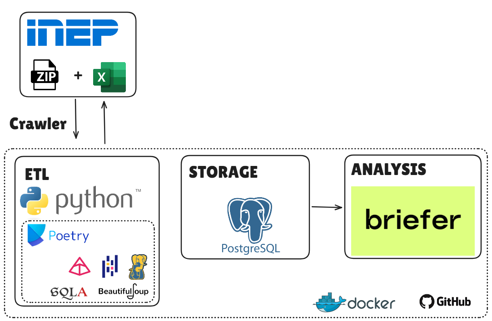
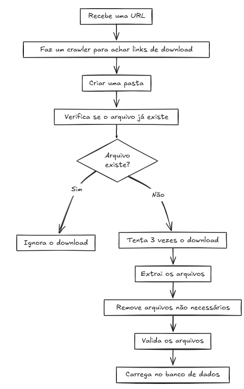

# Desafio DataGlowUp39:

## Transformando Dados do INEP


## Objetivo

Este projeto faz parte do desafio **DataGlowUp39** e tem como objetivo pegar dados públicos do INEP (Instituto Nacional de Estudos e Pesquisas Educacionais Anísio Teixeira), transformá-los e armazená-los em um banco de dados bem estruturado. O foco do projeto é garantir que o processo de extração, transformação e carga (ETL) seja bem executado, minimizando o risco de erros ao longo do caminho.
Além disso esse projeto demonstra de forma simplificada como seria um projeto real de ETL contando com etapas de extração, transformação validação e carga dos dados em um SGBD

## Dados

O projeto utiliza dados abertos disponíveis no inep

- [Indicadores Educacionais do INEP](https://www.gov.br/inep/pt-br/acesso-a-informacao/dados-abertos/indicadores-educacionais)

## Arquitetura

Para a arquitetura do projeto foram utilizados python com as bibliotecas descritas na imagem, postgres para armazenamento e subimos uma instancia briefer para futuras analises. E pode ser acessada no link:

https://excalidraw.com/#json=0A9b0nSjjW1GAbJRjSUfb,Zs5y1reLcLyYBp_m50iY4A



## Funcionalidades

- **Extração de dados**: A partir de URLs do INEP, são baixados os arquivos .ZIP e extraido os arquivos dele, seguido de remoção de todos os arquivos não importantes para o projeto, mantendo apenas os Excel alvos.
- **Transformação de dados**: Os dados extraídos são processados com pandas validações e são realizadas com pydantic atravez de um contrato de dados
- **Carregamento de dados**: Após a transformação, os dados são inseridos no banco de dados postgres de forma controlada e estruturada.

### Abaixo temos o fluxo simplificado do código 

<p align="center">
  
</p>

## Como rodar via docker

Para rodar o projeto via docker o único pré-requisito é o docker instalado


- clone o repositório
```bash
git clone https://github.com/cllaud99/DataGlowUp39.git
```

- Acesse a pasta do projeto

```bash
cd DataGlowUp39
```

- Renomei o arquivo .env.evemple para .env

- Suba os conteineres
```bash
docker compose up
```

## Pré-Requisitos via python

Python 3.12.7 ou superior e poetry

Este projeto utiliza o **Poetry** para gerenciar as dependências e o ambiente virtual do Python. Para instalar o Poetry, siga as instruções em [https://python-poetry.org/docs/#installation](https://python-poetry.org/docs/#installation).

As dependências do projeto podem ser instaladas com o comando:

```bash
poetry shell
poetry install
```

Para rodar o projeto via python basta executar o script principal. Para isso, utilize o seguinte comando:

```bash
poetry run python pipeline.py
```

## Estrutura do Projeto

A estrutura do projeto é organizada da seguinte forma:

```plaintext
.
├── extract
│   ├── crawler.py         # Funções para extrair links de arquivos
│   ├── download_files.py  # Funções para baixar os arquivos
│   └── extract_files.py   # Funções para extrair arquivos compactados
├── transform
│   ├── data_contract.py   # Definição dos modelos de dados (Pydantic)
│   └── transform_files.py # Funções para transformar os dados
├── load
│   └── db_operations.py   # Funções para inserir os dados no banco de dados
├── pipeline.py            # Script principal para rodar o processo ETL
├── pyproject.toml         # Arquivo de configuração do Poetry
└── README.md              # Este arquivo